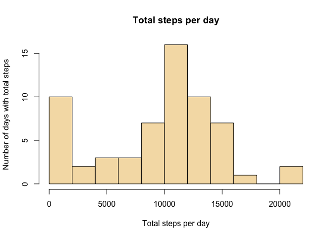
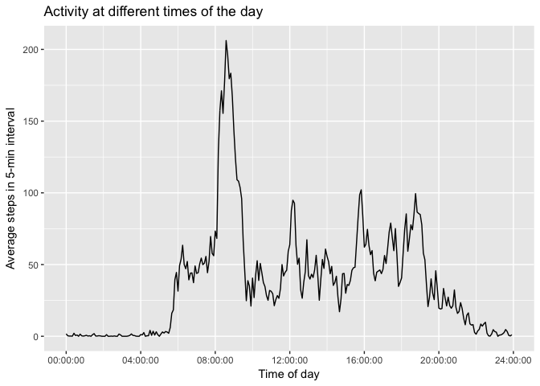
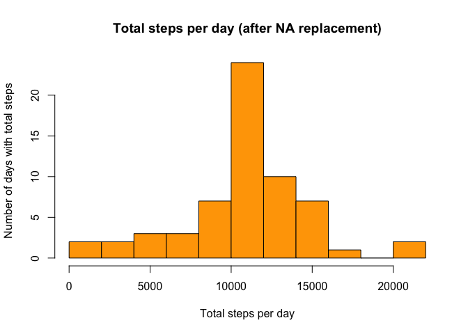
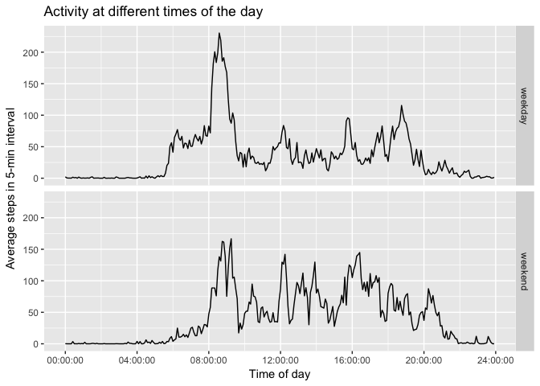

# Reproducible Research: Peer Assessment 1


## Loading and preprocessing the data

```r
ACT <- read.csv(unz("activity.zip","activity.csv"),na.strings="NA",colClasses=c("numeric","Date","numeric"))
```
The variables included in this dataset (variable "ACT") are:

1. **steps**: Number of steps taking in a 5-minute interval (missing values are coded as NA)
2. **date**: The date on which the measurement was taken in YYYY-MM-DD format. Gets converted to an R Date class value.
3. **interval**: Identifier for the 5-minute interval in which measurement was taken


## What is mean total number of steps taken per day?

Compute the total number of steps per day and store in the R object "ACT_s".

```r
ACT_s <- ACT %>% group_by(date) %>% summarise(steps.day=sum(steps,na.rm=TRUE))
```
Following is a chart of the number of days of different reported activity levels

```r
hist(ACT_s$steps.day,breaks=10,col="wheat",main="Total steps per day",
      xlab="Total steps per day",ylab="Number of days with total steps")
```

<!-- -->


```r
ACT_s_mean <- mean(ACT_s$steps.day)
ACT_s_median <- median(ACT_s$steps.day)
```

The mean total number of steps per day is  9354 (whereas the median is 10395).      

## What is the average daily activity pattern?
Compute the average number of steps per interval across all days and store in the R object "ACT_a".

```r
ACT_a <- ACT %>% group_by(interval) %>% summarise(steps.interval=mean(steps,na.rm=TRUE))
```
Create a new variable in "ACT_a" called "time_of_interval" of class "hms" to help ggplot to understand how to plot the time-series.


```r
ACT_a$time_of_interval <- hms(rep(0,length(ACT_a$interval)),ACT_a$interval%%100,floor(ACT_a$interval/100))
```
Here, then, a chart of the average number of steps per interval

```r
ggplot(ACT_a,aes(x=time_of_interval,y=steps.interval)) +
    geom_line() +
    scale_x_time(breaks=seq(0,24*3600,4*3600))+
    xlab("Time of day") +
    ylab("Average steps in 5-min interval") + 
    ggtitle("Activity at different times of the day")
```

<!-- -->

In this chart you can see that the time interval with the largest average number of steps over the days is:


```r
idx_max_steps <- which.max(ACT_a$steps.interval)
time_max_steps <- ACT_a$time_of_interval[idx_max_steps]
```

The largest average number of steps across the days happens in the 5-min interval that starts at 3.09\times 10^{4} hours.

## Imputing missing values

The dataset has missing values. Below we investigate how many.


```r
missing_steps <- is.na(ACT$steps)
```

The number of missing observations of steps is 2304.

The next code sections will replace the missing step counts with the average number of steps for the corresponding interval across all days measured. The R object "ACT_filled" will contain the adjusted dataset. The new, adjusted, dataset will be summarized as the R object "ACT_filled_s"


```r
ACT_filled <- ACT
for (i in 1:length(ACT$steps)) {
    if (is.na(ACT_filled$steps[i])) {
        ACT_filled$steps[i] <- ACT_a[ACT_a$interval==ACT_filled$interval[i],]$steps.interval
    }
}
```

```r
ACT_filled_s <- ACT_filled %>% group_by(date) %>% summarise(steps.day=sum(steps,na.rm=TRUE))
```

Following is a chart of the number of days of different reported activity levels:


```r
hist(ACT_filled_s$steps.day,breaks=10,col="orange",main="Total steps per day (after NA replacement)",
      xlab="Total steps per day",ylab="Number of days with total steps")
```

<!-- -->


```r
ACT_filled_mean_steps <- mean(ACT_filled_s$steps.day)
ACT_filled_median_steps <- median(ACT_filled_s$steps.day)
```

The adjusted dataset's mean (10766) and median 
(10766) total steps per day are now the same and larger than when the NA were still present.

## Are there differences in activity patterns between weekdays and weekends?

The following code introduces an additional variable "weekday" to capture whether the observations are for a Mon-Fri "weekday" or a Sat-Sun "weekend" day. It also summarizes the average steps per day into the R object "ACT_filled_a" by the category "weekday" just described.


```r
ACT_filled$weekday <- ifelse(weekdays(ACT_filled$date) %in% c("Saturday", "Sunday"), "weekend", "weekday")
ACT_filled_a <- ACT_filled %>% group_by(weekday,interval) %>% summarise(steps.interval=mean(steps))
ACT_filled_a$time_of_interval <- hms(rep(0,length(ACT_filled_a$interval)),
                                     ACT_filled_a$interval%%100,floor(ACT_filled_a$interval/100))
```

With the summarized data its possible to observe some differences between activity on a "weekday" and a "weekend" day.


```r
ggplot(ACT_filled_a,aes(x=time_of_interval,y=steps.interval)) +
    geom_line() +
    scale_x_time(breaks=seq(0,24*3600,4*3600))+
    xlab("Time of day") +
    ylab("Average steps in 5-min interval") + 
    ggtitle("Activity at different times of the day") +
    facet_grid(weekday ~ .)
```

<!-- -->

